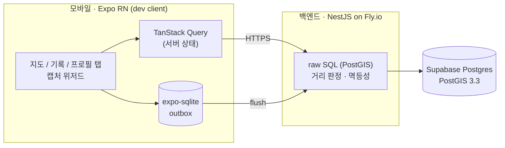

<div align="center">


# 오르다 (hiking-app)

**등반한 코스가 지도에 색칠된다. 지도가 곧 나의 등산 이력이다.**

GPS 한 점으로 코스 완등을 인증하고, 지도에서 완등한 코스를 난이도 색상으로 채워나가는 한국 등산 인증 앱.


</div>

---

## 왜 이 앱인가

등산 이력을 남기는 앱은 많다. 트랭글은 **배지 목록**, 블랙야크 BAC는 **체크리스트**로 푼다. 하지만 등반 이력이 **지도 위에 누적 채색되는 시각적 자산**으로 쌓이는 경험은 비어 있다. 오르다의 유일한 차별점은 하나 — **코스 단위로 색칠되는 나만의 정복 지도**.

**v0 데모 루프** (이것만으로 닫힌다):

```
가입 → 지도에서 산 보기 → 정상에서 탭 한 번으로 완등 인증 → 코스 색칠 → 기록 조회
```

네트워크가 없어도 인증된다. 로컬 판정 후 outbox에 쌓고, 연결되면 서버로 flush한다.

## 핵심 설계 결정

이 프로젝트는 코드 이전에 **3라운드 팀 리뷰**(기술 검증 → 적대적 리뷰 → 교차 피드백)를 거친 설계 문서(`docs/01~07`)에서 출발했다. 틀리면 비싼 결정들:

| 결정 | 이유 |
| --- | --- |
| 좌표는 `geography(Point,4326)` | `geometry`면 `ST_DWithin`이 미터가 아닌 **도(degree)**로 재서 반경 판정이 조용히 다 통과된다. 최상위 리스크 |
| 판정은 **관대하게(lenient)** | 거리·속도·mock 이상은 거절이 아니라 `flags`만 남긴다. 야외 GPS 오차를 사용자 탓으로 돌리지 않기 위해 |
| 멱등성 | `client_ref` 유니크로 재전송은 200 replay, 하루 중복은 `uq_climbs_daily`로 거절 — 오프라인 재시도가 중복 완등을 만들지 않는다 |
| `climbed_on`은 KST 기준 생성 컬럼 | `AT TIME ZONE`은 stable이라 생성 컬럼에 못 써서 immutable `kst_date()` 래퍼 경유 |
| RLS enable만 (정책 없음) | PostgREST anon 노출 차단용. NestJS는 postgres role 직결이라 무관 |

전체 근거는 [`docs/`](./docs) 와 [ADR](./docs/adr) 참조.

## 아키텍처



- **지오는 raw SQL** — TypeORM 엔티티는 `users`만(ADR-002). 거리 판정은 `ST_DWithin(geography, geography, meters)`.
- **에러 봉투 고정** — `{ error: { code, message } }`. 클라이언트는 `code`로 분기.
- **인증** — access 1h / refresh 90d. 로그인 throttle은 IP 기준(Fly 뒤라 trust proxy).

## 기술 스택

| 레이어 | 스택 |
| --- | --- |
| 모바일 | Expo SDK 57 · React Native 0.86 · Expo Router · TanStack Query · expo-sqlite · 네이버 지도(native, dev client 필수) |
| 백엔드 | NestJS · raw SQL(PostGIS) · JWT 인증 · Fly.io(nrt, auto stop/start) |
| DB | Supabase Postgres + PostGIS 3.3 (ap-northeast-1) |
| 데이터 | 산림청 SHP → PostGIS ETL, v0는 북한산·관악산·청계산 수동 시딩 |

## 저장소 구조

| 폴더 | 역할 |
| --- | --- |
| [`mobile/`](./mobile) | Expo 앱. dev client 필수 — 네이버 지도 native 모듈이라 Expo Go 불가 |
| [`api/`](./api) | NestJS v0 백엔드. 지오는 raw SQL, 엔티티는 users만. Fly.io 배포 |
| [`supabase/`](./supabase) | PostGIS 스키마 마이그레이션 + v0 시드 |
| [`docs/`](./docs) | 기획·아키텍처 문서(01~07) + ADR. **바꾸기 전에 먼저 읽을 것** |

## 실행

```bash
# 백엔드 (api/.env 필요 — DATABASE_URL, JWT_SECRET)
cd api && npm run start:dev        # 로컬 :3000
node scripts/smoke.mjs             # E2E 스모크 (signup→courses→climbs→me→refresh→delete)

# 앱 (dev client 빌드가 폰/시뮬레이터에 설치돼 있어야 함)
cd mobile && npx expo start        # 폰과 같은 Wi-Fi
```

- **배포 백엔드**: `https://hiking-api-v0.fly.dev`
- **Supabase**: PostGIS 3.3, ap-northeast-1

## 상태

백엔드 · DB · 앱 코드 완성. 프로덕션 배포 + E2E 스모크 통과. 현재 v0 데모 범위:

- ✅ 이메일/비번 가입 · 로그인 (게스트 둘러보기 지원)
- ✅ 지도에서 산·코스를 난이도 색상으로 조회 (bbox + zoom)
- ✅ GPS 완등 인증 (오프라인 outbox + 포그라운드 flush, 관대 판정)
- ✅ 완등 코스 지도 색칠 · 마일스톤 기반 등급/배지
- ✅ 기록 탭 · "나의 n번째 산" 카운터

**비범위(v0)**: 리더보드, 커뮤니티, 사진/공유 카드, 검색 UI, 다크 모드. 로드맵은 [`docs/01-product-spec.md`](./docs/01-product-spec.md) §5·§9 참조.
