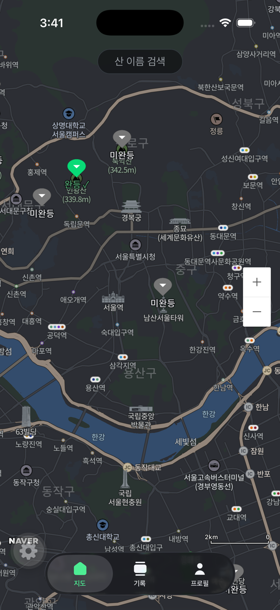
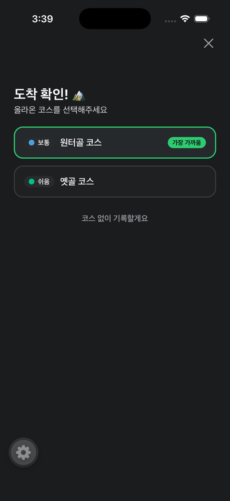
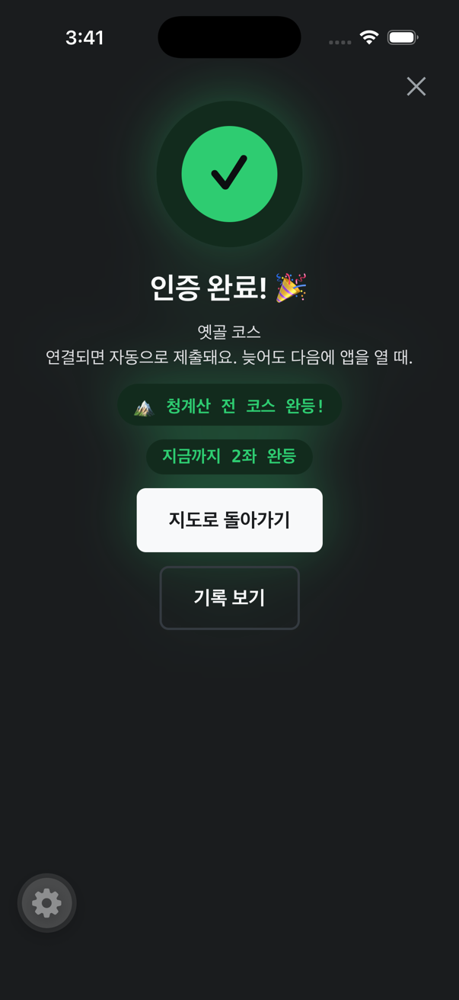
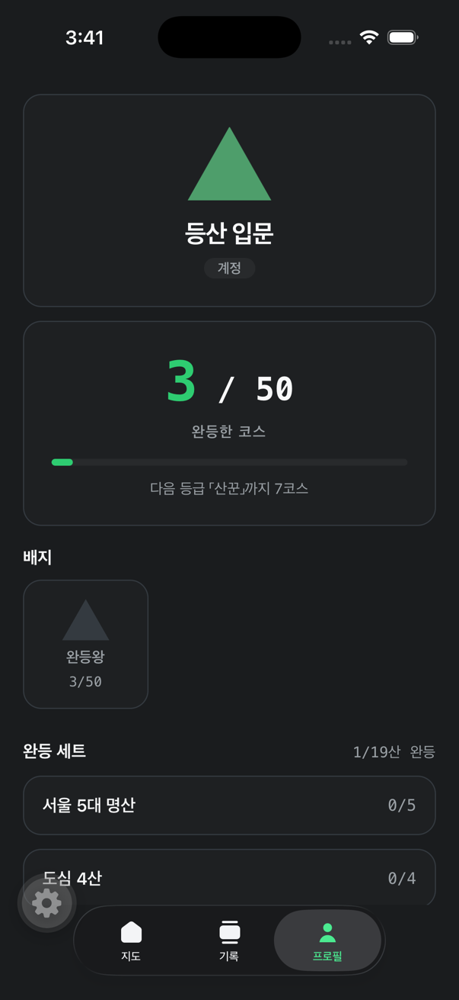
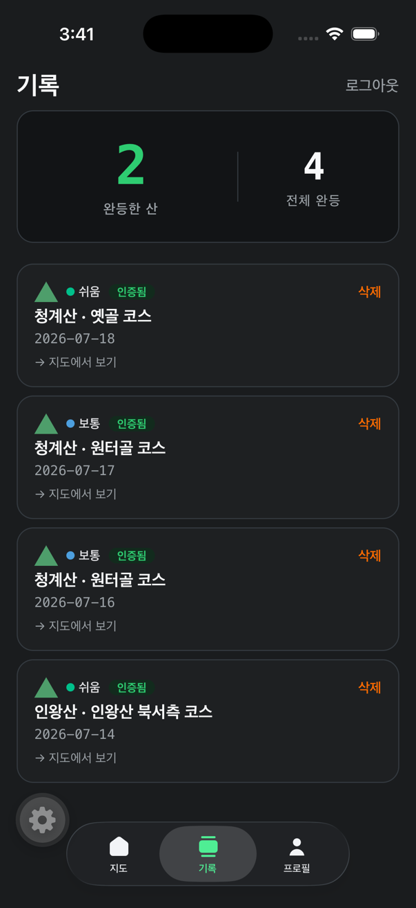
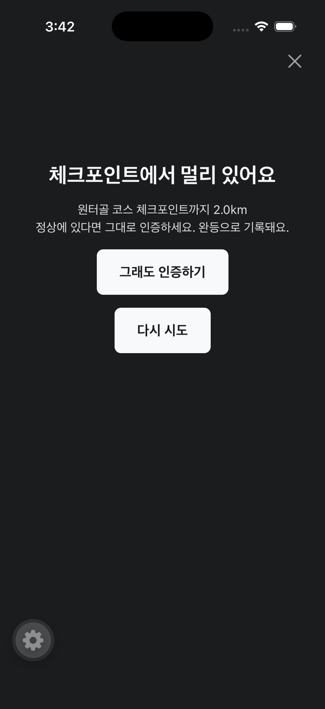
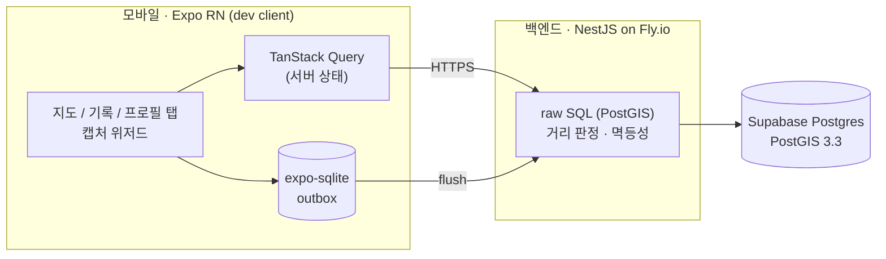

<div align="center">


# 오르다 (OREUDA)

**등반한 코스가 지도에 색칠된다. 지도가 곧 나의 등산 이력이다.**

GPS 한 점으로 코스 완등을 인증하고, 지도에서 완등한 코스를 색으로 채워나가는 한국 등산 인증 앱.


[](https://github.com/seungyoon-lee29/OREUDA/actions)

</div>

---

## 미리보기

| 완등 지도 (다크·네이버 지도) | 도착 확인 | 완등 인증 성공 |
| :---: | :---: | :---: |
|  |  |  |
| 서울 19산 · 코스는 산 탭 시 노출 | 체크포인트 도착 → 코스 선택 | 산 완등·세트 완성 시 축하 배너 |

| 프로필 — 완등 세트 | 기록 | 관대 판정 — 소프트 확인 |
| :---: | :---: | :---: |
|  |  |  |
| 등급 · 큐레이션 5세트 · N/19산 | 인증됨 칩 · 지도 점프 · 삭제 | 막다른 실패 없음 — 확인 후 통과+flag |

## 프로젝트 정보

| | |
| --- | --- |
| **기간** | 2026.06 – 2026.07 (v0 프로덕션 운영 중) |
| **인원** | 1인 풀스택 — 기획 · 설계 · 모바일 · 백엔드 · DB · 데이터 파이프라인 · 배포 |
| **프로세스** | 설계 문서 7편([`docs/01~07`](./docs)) 선행 → 구현 → **리뷰 게이트**(코드리뷰 + 이종 모델 적대 리뷰) → E2E 스모크 → 프로덕션 반영. AI 에이전트 협업 워크플로를 직접 설계·운영 |
| **배포** | 백엔드 `https://hiking-api-v0.fly.dev` (Fly.io nrt) · DB Supabase PostGIS (ap-northeast-1) |

## 왜 이 앱인가

등산 이력을 남기는 앱은 많다. 트랭글은 **배지 목록**, 블랙야크 BAC는 **체크리스트**로 푼다. 하지만 등반 이력이 **지도 위에 누적 채색되는 시각적 자산**으로 쌓이는 경험은 비어 있다. 오르다의 유일한 차별점은 하나 — **코스 단위로 색칠되는 나만의 완등 지도**.

```
가입 → 지도에서 산 보기 → 정상에서 탭 한 번으로 완등 인증 → 코스 색칠 → 기록·컬렉션
```

네트워크가 없어도 인증된다. 로컬 판정 후 outbox에 쌓고, 연결되면 서버로 flush한다.

## 핵심 설계 결정

코드 이전에 **3라운드 팀 리뷰**(기술 검증 → 적대적 리뷰 → 교차 피드백)를 거친 설계 문서(`docs/01~07`)에서 출발했다. 틀리면 비싼 결정들:

| 결정 | 이유 |
| --- | --- |
| 좌표는 `geography(Point,4326)` | `geometry`면 `ST_DWithin`이 미터가 아닌 **도(degree)**로 재서 반경 판정이 조용히 다 통과된다. 최상위 리스크 |
| 판정은 **관대하게(lenient)** | 거리·속도·mock·정확도 이상은 거절이 아니라 `flags`만 남긴다. 야외 GPS 오차를 사용자 탓으로 돌리지 않기 위해 |
| 멱등성 | `client_ref` 유니크로 재전송은 200 replay, 하루 중복은 partial unique로 거절 — 오프라인 재시도가 중복 완등을 만들지 않는다 |
| `climbed_on`은 KST 기준 생성 컬럼 | `AT TIME ZONE`은 stable이라 생성 컬럼에 못 써서 immutable `kst_date()` 래퍼 경유 |
| 위치는 인증 순간 **한 점만** | 백그라운드 추적 없음 — 프라이버시가 곧 배터리 전략 ([`docs/07`](./docs/07-security-privacy.md)) |

전체 근거는 [`docs/`](./docs) 와 [ADR](./docs/adr) 참조.

## 기술적 도전과 해결

<details>
<summary><b>1. "정상에 서 있는데 인증이 안 돼요" — 막다른 실패의 해체</b></summary>

- **문제**: 체크포인트 150m 밖이거나 GPS 정확도가 나쁘면 앱이 인증을 하드 차단('다시 시도'만) — 서버는 관대 판정(flag만)인데 클라이언트가 스펙을 위반하고 있었다.
- **원인 분해**: 감사 스크립트로 50개 코스의 checkpoint↔정상 정렬을 전수 측정해 가설을 반증하며 좁혔다. 데이터가 아니라 **클라이언트 게이트**가 원인.
- **해결**: 막다른 차단 → 소프트 확인("그래도 인증하기") 후 통과 + 서버 `accuracy` flag 신설로 정합 복원. 적대 리뷰가 잡은 구멍(코스 미선택 제출 시 거리 flag 회피)은 **marginal 캡처에 최근접 코스 선부착**으로 봉쇄.
- **검증**: 경계 유닛 테스트(100/101m·150/151m) + 시뮬 위치 위조 E2E + 프로덕션 스모크.
</details>

<details>
<summary><b>2. 산 정상 좌표가 틀렸다 — 지오 데이터 실측 검증</b></summary>

- **문제**: OSM 기반 ETL이 채택한 정상 좌표가 일부 산에서 실제 정상과 150m 이상 어긋남(우면산 222m, 일자산 170m) — 정상에 서도 반경 밖.
- **접근**: 19산 전수 실측 대조 — **DEM 국지최고점 + 위키/Wikidata + OSM peak 전수 + 구청 공식** 4중 교차. 위키 계열 좌표의 복사 오류 3건도 이 과정에서 발견.
- **해결**: 우면산은 실정상이 군부대 안이라 등산객의 실질 정상(소망탑)을 인증점으로(통제구역 선례 준용). 코스 재라우팅은 **id·이름·source_id를 보존**한 채 경로·checkpoint만 갱신 — 기존 완등 기록(FK)이 깨지지 않는다.
- **검증**: 프로덕션 적용을 트랜잭션+문장별 영향행수 단언으로, 적용 후 7코스 전부 checkpoint↔정상 0.0m.
</details>

<details>
<summary><b>3. 오프라인 완등을 절대 잃지 않기 — outbox와 유실 경로 사냥</b></summary>

- **설계**: 판정 통과 즉시 expo-sqlite outbox에 durable 저장 → 연결 시 flush. 서버는 `client_ref` 멱등이라 재전송·콜드스타트 재큐가 전부 안전(replay).
- **감사로 잡은 유실 3경로**: ①429/401을 영구 실패로 종결(스로틀은 IP 키라 통신사 CGNAT에서 남의 트래픽으로도 발생) → 재큐로 전환 + 스로틀 키를 인증 사용자 기준으로 ②같은 계정 재로그인 시 미전송 초안 무조건 삭제 → 계정 비교 후 보존 ③기기 시계가 빠르면 전 인증 4xx → 2분 허용오차 + 서버 시각 clamp(KST 자정 중복 슬롯 선점까지 차단).
</details>

<details>
<summary><b>4. 코스 데이터 품질 — "코스가 지하철역에서 시작해요"</b></summary>

- **문제**: OSM 최단경로 ETL이 도시 보도(footway)까지 경로에 포함 — 코스 시작점이 정상에서 직선 3~4km 도심.
- **해결**: 경로 선두의 footway 연속 구간 트림(소형 공원산 보호 가드 포함). **upsert 연속성이 관건** — source_id를 트림 전 기준으로 고정해 재실행이 코스를 중복 생성하지 않게. 42코스 재생성에서 10코스 교정(최대 4.3km→1.1km).
- **부산물**: 풀 재생성은 코스 선택이 드리프트해 프로덕션에 위험함을 실측으로 확인 → 빌드 스크립트에 경고 가드 명문화.
</details>

## 아키텍처



- **지오는 raw SQL** — TypeORM 엔티티는 `users`만([ADR-002](./docs/adr)). 거리 판정은 `ST_DWithin(geography, geography, meters)`.
- **에러 봉투 고정** — `{ error: { code, message } }`. 클라이언트는 `code`로 분기.
- **인증** — JWT access 1h / refresh 90d. 쓰기 스로틀은 사용자 키(비인증 경로는 IP).

## 기술 스택 — 채택 이유

| 레이어 | 스택 | 왜 |
| --- | --- | --- |
| 모바일 | Expo SDK 57 · RN 0.86 · Expo Router · TanStack Query · expo-sqlite | 1인 개발 속도 + 네이티브 모듈(네이버 지도)은 dev client로. 서버 상태/로컬 durable 저장의 역할 분리 |
| 지도 | 네이버 지도 (native) | 한국 등산로 컨텍스트에서 국내 지도의 산·등산로 표현이 압도적. Expo Go 포기를 감수 |
| 백엔드 | NestJS · **raw SQL**(PostGIS) | 지오 판정은 SQL이 본체 — ORM 추상화가 `geography` 캐스팅 실수를 숨기는 걸 차단. 엔티티는 users만 |
| DB | Supabase Postgres + PostGIS 3.3 | 반경 판정·bbox 조회가 전부 DB 네이티브. RLS는 PostgREST anon 차단용으로만 |
| 데이터 | OSM Overpass → 자체 ETL(`supabase/etl`) | 실경로 42코스 시딩. 재실행 안전(upsert) + 트림·재라우팅 도구 포함 |
| 인프라 | Fly.io (nrt, auto stop/start) | 콜드스타트 2~3초를 감수하고 유지비 최소화. GitHub Actions CI |

## 저장소 구조

| 폴더 | 역할 |
| --- | --- |
| [`mobile/`](./mobile) | Expo 앱. dev client 필수 — 네이버 지도 native 모듈이라 Expo Go 불가 |
| [`api/`](./api) | NestJS v0 백엔드. 지오는 raw SQL, 엔티티는 users만. Fly.io 배포 |
| [`supabase/`](./supabase) | PostGIS 스키마 마이그레이션 + 시드/ETL |
| [`docs/`](./docs) | 기획·아키텍처 문서(01~07) + ADR + 에이전트 협업 규약 |

## 실행

```bash
# 백엔드 — api/.env 필요 (api/.env.example 참조: DATABASE_URL, JWT_SECRET)
cd api && npm run start:dev        # 로컬 :3000
node scripts/smoke.mjs             # E2E 스모크 (signup→courses→climbs→me→refresh→delete)

# 앱 — dev client 빌드가 폰/시뮬레이터에 설치돼 있어야 함
cd mobile && npx expo start        # 폰과 같은 Wi-Fi
```

## 품질과 검증

- **테스트**: 판정 경계 중심 — api 유닛(거리/정확도/시계 skew/스로틀 키 경계) · mobile 유닛 31(파생 로직·완등 세트·운동 요약) · E2E 스모크 18체크(멱등성·하루 중복·mock flag 포함, 프로덕션 대상 실행).
- **리뷰 게이트**: 지오 판정·마이그레이션·멱등성 등 "틀리면 비싼" 변경은 코드리뷰 → **이종 모델 적대 리뷰** → 반영. 적대 리뷰가 잡은 실제 구멍(flag 회피 경로, 스로틀 우회, KST 자정 선점)이 게이트의 존재 이유.
- **데이터 검증**: 시드·교정은 감사 스크립트(전수 거리 측정)와 identity diff(source_id 불변)로 이중 확인 후 트랜잭션 적용.

## 상태 (v0 프로덕션)

- ✅ 이메일 가입/로그인 (JWT) · 다크 테마
- ✅ 지도: 서울 19산 42코스 실경로 · **완등 코스 상시 색칠**(누적 채색 지도) · 산 탭 → 코스선
- ✅ GPS 완등 인증: 오프라인 outbox · 관대 판정(소프트 확인+flag) · 멱등 제출
- ✅ 등반 세션: 시작 → 실시간 정상 거리 배너 → 완등 인증
- ✅ 컬렉션: 등급 · 완등 세트(큐레이션 5세트) · N/19산 · 완등 축하 배너
- ✅ 기록: 인증됨 칩 · 지도 점프 · 완등 삭제

**비범위(v0)**: 리더보드, 커뮤니티, 사진/공유 카드 — 로드맵은 [`docs/01`](./docs/01-product-spec.md) §5·§9.

## 배운 점

- **설계 문서가 가장 싼 디버거였다.** `geography` vs `geometry` 함정은 코드 한 줄 쓰기 전 설계 리뷰에서 잡혔다 — 런타임이었다면 "조용히 전부 통과"라 발견조차 어려웠다.
- **지오 데이터는 실측 없이 믿으면 안 된다.** OSM·위키 좌표 모두 오류가 있었고, DEM 교차 검증이 아니었으면 "정상에서 인증 안 되는 산"을 출시할 뻔했다.
- **관대한 판정은 UX 문구가 아니라 시스템 불변식이다.** 클라이언트 게이트 하나가 서버 스펙과 어긋나는 순간 사용자는 막다른 실패를 만난다 — 정합성은 계약으로 지켜야 한다.
- **적대 리뷰는 비용이 아니라 보험이다.** 스스로 만든 수정이 연 구멍(flag 회피)을 같은 시선으로는 못 본다.
