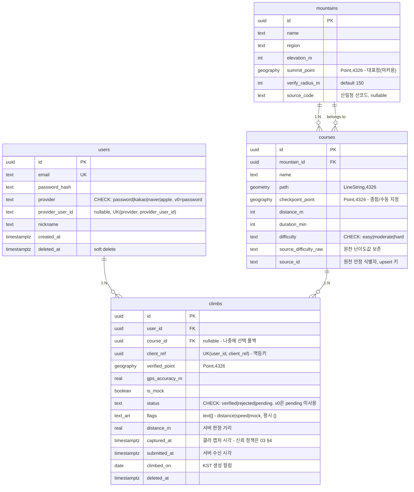

# 02. 백엔드 스펙 — DB 스키마 + API

> 저장 구조와 API 계약의 정본. **인증 상태 시맨틱(`status`/`flags`의 의미, 관대 정책)은 [03](./03-verification.md)이 정본**이며 이 문서는 저장·인덱스·전송 형태만 다룬다. 스택: NestJS + TypeORM + PostgreSQL/PostGIS ([ADR-002](./adr/ADR-002-geo-stack.md)).

## 1. ERD



## 2. 지오 타입 결정 — geography 필수

- 포인트 비교 컬럼(`summit_point`, `checkpoint_point`, `verified_point`)은 전부 **`geography(Point, 4326)`** — `ST_DWithin` 반경이 미터 단위가 된다.
- `geometry`로 두고 미터 반경을 넣으면 도(degree) 단위로 해석되어 **모든 제출이 조용히 통과**한다([03 §1](./03-verification.md) — 최상위 리스크). 테스트 경계값 표(README)에 이 케이스를 반드시 포함.
- `courses.path`는 렌더 전송용이라 `geometry(LineString, 4326)` 유지(연산 대상 아님). [v1] `path_low`(단순화 LOD) 컬럼 추가 — EPSG:5179 투영 후 `ST_SimplifyPreserveTopology` 50m, ETL 시점 사전 계산.
- 스페이셜 연산은 TypeORM QueryBuilder raw 표현식으로 작성한다 ([ADR-002](./adr/ADR-002-geo-stack.md)).

## 3. 제약·인덱스

```sql
-- 멱등키: 같은 캡처의 재제출을 서버가 식별
ALTER TABLE climbs ADD CONSTRAINT uq_climbs_client_ref UNIQUE (user_id, client_ref);

-- 하루 1회(같은 코스, KST 달력일, verified만): 거부된 인증이 재시도를 막지 않도록 partial
CREATE UNIQUE INDEX uq_climbs_daily ON climbs (user_id, course_id, climbed_on)
  WHERE status = 'verified' AND deleted_at IS NULL;

-- climbed_on은 KST 기준 생성 컬럼 (함수 인덱스의 IMMUTABLE 이슈 회피)
-- climbed_on date GENERATED ALWAYS AS ((captured_at AT TIME ZONE 'Asia/Seoul')::date) STORED

-- 지오
CREATE INDEX idx_courses_path ON courses USING GIST (path);
CREATE INDEX idx_mountains_summit ON mountains USING GIST (summit_point);

-- 조회
CREATE INDEX idx_climbs_user ON climbs (user_id, status, climbed_on);
```

- **`uq_climbs_daily` 충돌은 insert가 아니라 검증 전이 시점에 발생한다** — flagged도 `status='verified'`이므로 슬롯을 점유하고, 같은 날 같은 코스의 2번째 verified 전이가 충돌 → `duplicate_day` rejected로 종결된다.
- [v1] 리더보드: `CREATE INDEX ... ON climbs (user_id, climbed_on) WHERE status='verified' AND flags='{}' AND deleted_at IS NULL`.
- 데이터 갱신: courses는 `source_id` 기준 **upsert** 시딩([06 §4](./06-data-pipeline.md)) — climbs의 FK가 재시딩에 깨지지 않는다.

## 4. 마이그레이션 전략

TypeORM migration 사용(자동 sync 금지). enum 대신 `text + CHECK`를 쓰는 이유: PostgreSQL native enum은 값 추가 마이그레이션이 성가시고, `status`의 `'pending'`처럼 "예약만 하고 미사용"([03 §2](./03-verification.md)) 패턴이 CHECK에서는 무비용이다.

## 5. API — v0 표면 전체

공통: prefix `/v1`. 인증은 JWT Bearer(access) + **고정 refresh(v0, rotation은 [v1])**, refresh는 클라 SecureStore 보관. **조회성 GET은 public read**(게스트 전환 대비, [01 §7](./01-product-spec.md)), 쓰기만 인증 필수.

| 메서드/경로 | 인증 | 설명 |
|---|---|---|
| `POST /v1/auth/signup` | - | 이메일/비번. throttle IP 기준 5회/분 |
| `POST /v1/auth/login` | - | throttle IP+계정 5회/분 |
| `POST /v1/auth/refresh` | refresh | access 재발급 |
| `GET /v1/courses?bbox=&zoom=` | public | §5.1 |
| `GET /v1/mountains/:id` | public | 산 상세 + 코스 리스트(§5.1과 동일 코스 페이로드) |
| `POST /v1/climbs` | O | §5.2 — 동기 검증, 멱등 |
| `GET /v1/me/climbs` | O | §5.3 — 기록 탭 + 색칠 하이드레이션 + 카운터 |
| `DELETE /v1/climbs/:id` | O | soft delete |

### 5.1 `GET /v1/courses?bbox=&zoom=`

- `bbox`: `minLng,minLat,maxLng,maxLat`. `ST_Intersects(path, ST_MakeEnvelope(...))`.
- **`zoom`: v0 서버는 받되 무시한다(계약에 명기).** [v1]에서 zoom 임계값에 따라 `path_low` 반환으로 활성화. 클라는 v0부터 zoom을 보내며 자체 렌더 게이트로 쓴다 ([04 §7](./04-client-architecture.md)).
- 코스 페이로드 계약 — **오프라인 로컬 판정의 전제이므로 필수 필드**:

```json
{ "id": "…", "mountainId": "…", "name": "…",
  "path": { "type": "LineString", "coordinates": [[lng, lat], …] },
  "checkpointPoint": { "type": "Point", "coordinates": [lng, lat] },
  "verifyRadiusM": 150,
  "difficulty": "moderate", "distanceM": 4200, "durationMin": 150 }
```

클라는 산 상세 진입 시 이 페이로드를 로컬 캐시(프리페치)하여 오프라인 위저드에 사용한다 ([04 §5](./04-client-architecture.md)). `verifyRadiusM`은 클라 zod에서 `min(10).max(2000)` 검증(단위 버그 조기 감지, [03 §5](./03-verification.md)).

### 5.2 `POST /v1/climbs` — 동기 검증, client_ref 멱등

요청 바디는 [03 §6](./03-verification.md). 응답:

```json
// 201 신규  |  200 client_ref 재생 (동일 바디 + "replayed": true)
{
  "climbId": "uuid",
  "clientRef": "…",              // 에코 필수 — outbox 행 매칭 키
  "status": "verified",          // verified | rejected
  "flags": ["distance"],         // 의미는 03 §2. 평시 []
  "distanceM": 812,              // 판정 거리 — 성공 포함 상시 공개
  "climbedOn": "2026-07-02",
  "leaderboardEligible": false   // flags.length === 0 파생
}
```

- **재생(replay)**: 같은 `(user_id, client_ref)` 재제출 → `200` + 기존 결과 동일 스키마 + `replayed: true`. 네트워크 타임아웃 후 재-flush가 정상 경로이므로 v0에서 반드시 발생한다.
- **중복(duplicate)**: `uq_climbs_daily` 충돌 → `200` + `status: "rejected"`, `reason: "duplicate_day"`, `existingClimbId` 포함 — 클라는 기존 climb으로 색칠을 reconcile한다. 재생과 응답 형태로 명확히 구분된다.
- **4xx 종결**: 스키마 오류, 인증 실패, `captured_at` 미래/역전([03 §4](./03-verification.md)) — 클라는 draft를 폐기한다.
- 검증 실패(거리 등)는 4xx가 아니라 **2xx + flags**다(관대 정책, [03 §3](./03-verification.md)).
- throttle: 사용자당 시간당 상한(예: 30회).

### 5.3 `GET /v1/me/climbs`

기록 탭, verified 색칠 하이드레이션, 카운터를 한 번에 먹인다:

```json
{
  "totalMountains": 12,          // "나의 12번째 산" 카운터 소스
  "totalClimbs": 17,
  "climbs": [ { "climbId": "…", "courseId": "…", "status": "verified",
                "flags": [], "climbedOn": "…",
                "mountain": { "id": "…", "name": "북한산" },
                "course": { "name": "백운대 코스", "difficulty": "hard" } } ]
}
```

v0 데이터 규모(개인 기록 수십 건)에서 페이지네이션 불필요 — [v1]에서 cursor 추가.

## 6. 에러 규약

```json
{ "error": { "code": "AUTH_INVALID_CREDENTIALS", "message": "…" } }
```

- 4xx: 코드 열거(AUTH_*, VALIDATION_*, THROTTLED). 429는 `Retry-After` 헤더.
- 도메인 결과(검증 실패, 중복)는 에러가 아니다 — 2xx + `status`/`flags`/`reason` (§5.2).

## 7. 배포 토폴로지 요약

기본값: DB=Supabase(PostGIS 지원), API=Fly.io(nrt), 스토리지[v1]=Cloudflare R2. 선정 근거·대안 비교·리스크(Fly 서울 리전 없음, Supabase 무료 티어 pause)는 [ADR-003](./adr/ADR-003-hosting.md).
