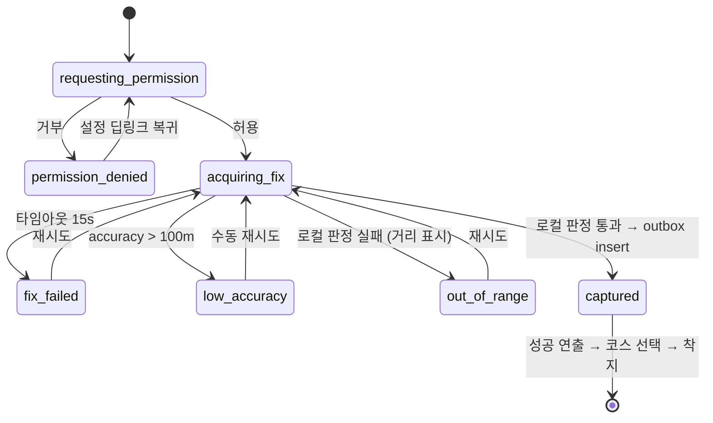
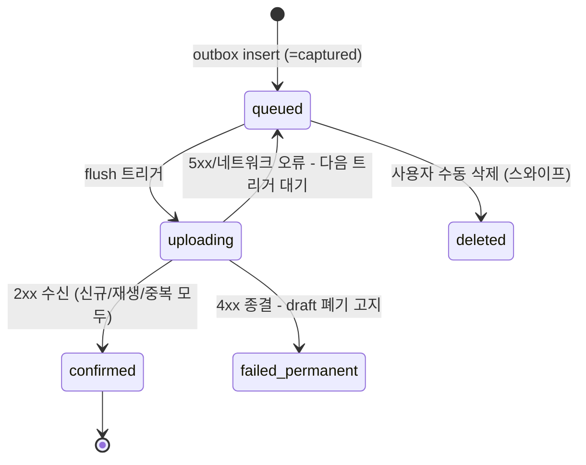

# 04. 클라이언트 아키텍처 — 클라 상태 정본

> **이 문서가 클라이언트 상태(위저드/큐 상태머신)와 서버→클라 매핑의 단일 정본이다.**
> 서버 상태 시맨틱은 [03](./03-verification.md) 정본을 참조하고, 각 상태의 시각·카피는 [05 §4~6](./05-design.md)이 이 문서의 상태 키를 1:1로 커버한다. 스택: Expo(dev client, New Arch) + Expo Router.

## 1. 데이터 레이어 — 3층 책임 분리

| 층 | 담당 | 도구 | 비고 |
|---|---|---|---|
| 서버 상태 | 산/코스/내 기록 조회 캐시 | **TanStack Query v5** | `onlineManager`를 NetInfo에 배선 |
| 인증 큐 (도메인 크리티컬) | 캡처→제출 outbox | **expo-sqlite 자체 outbox + QueueProcessor 싱글턴** | TanStack persisted mutation **금지** — mutationFn 직렬화 불가, resume stuck 버그 이력. 도메인 불변식을 라이브러리 내부 상태에 맡기지 않는다 |
| UI 상태 | 뷰포트, 바텀시트, 위저드 세션 | **Zustand** | 셀렉터 구독으로 리렌더 격리 |

**색칠 데이터의 SSOT**:
- `pending` 색칠(서버 미확정) = **outbox 파생 Set** — Zustand가 아니다. 앱 재시작 후에도 색칠이 유지되어야 리워드가 신뢰를 얻는다.
- `verified` 색칠 = `GET /v1/me/climbs` 쿼리 캐시에서 파생한 `Set<courseId>` — 재설치/재로그인 시 하이드레이션 경로.
- 렌더 시 두 Set을 O(1) 룩업(타일 데이터와 병합하지 않는다).

## 2. 기술 스택 결정 표

| 영역 | 결정 | 마킹/비고 |
|---|---|---|
| 지도 | @mj-studio/react-native-naver-map v2 | [ADR-001](./adr/ADR-001-map-sdk.md) |
| 네비게이션 | Expo Router (typed routes) | |
| 서버 상태 | @tanstack/react-query v5 | |
| UI 상태 | zustand | |
| 오프라인 큐 | expo-sqlite | outbox 전용 |
| 네트워크 감지 | **@react-native-community/netinfo** | 트리거 ①의 핵심 의존성 — 네이티브 모듈, dev client 빌드에 포함 |
| 경량 k/v | react-native-mmkv | 온보딩 플래그 등 |
| 토큰 보관 | expo-secure-store | 고정 refresh(v0), rotation [v1] |
| 위치 | expo-location, `Accuracy.BestForNavigation` | **백그라운드 위치 권한 요구 금지**(심사 리스크 — 파티는 로드맵) |
| 바텀시트 | @gorhom/bottom-sheet (+reanimated, gesture-handler) | |
| 이미지 | expo-image | |
| 에러/계측 | @sentry/react-native | v0 필수 — [01 §8](./01-product-spec.md) 지표 매핑 |
| 스키마 검증 | zod (packages/shared 공유) | API 응답 + outbox payload. `verifyRadiusM` min(10).max(2000) 가드 포함 |
| 공유 카드 | @shopify/react-native-skia + expo-sharing | **[v1]** — 네이티브 의존성이므로 v0 빌드에 포함하지 않음 |
| 폼 라이브러리 | **채택 안 함** | 로그인/가입 controlled input 2개로 충분 — 의도적 결정 |
| 전체 캐시 영속화 | **채택 안 함** | persistQueryClient 스킵 — 산 상세 프리페치만 명시적 저장(§5) |

## 3. outbox 스키마 (expo-sqlite)

```sql
CREATE TABLE climb_drafts (
  local_uuid   TEXT PRIMARY KEY,   -- POST의 clientRef가 됨 (멱등키)
  payload_json TEXT NOT NULL,      -- 03 §6의 검증 입력
  state        TEXT NOT NULL,      -- 큐 상태머신 (§4)
  attempt_count INTEGER DEFAULT 0,
  last_attempt_at TEXT,
  last_error   TEXT,
  server_result_json TEXT,         -- flush 성공 시 응답 보관 (매핑 표의 소스)
  captured_at  TEXT NOT NULL
);
```

- [v1] 사진 도입 시 `photo_local_uri` 컬럼 추가 — 사진 파일은 `FileSystem.documentDirectory`에 저장(cacheDirectory는 OS가 임의 삭제).

## 4. 상태머신 — 정본

### 4.1 캡처 위저드 (세션 상태, Zustand)



- **성공의 정의 = `captured`(로컬 캡처 완료) 시점.** 서버 검증이 아니다 — 오프라인에서도 100% 성공 경험. 축하 연출의 트리거는 **outbox insert 완료 이벤트**다.
- `out_of_range` 화면은 로컬 계산 거리를 표시한다("체크포인트까지 320m") — 서버의 `distanceM` 공개 정책([03 §3](./03-verification.md))과 동일 단위.
- 실패 상태 전수(권한/fix/정확도/반경 밖)의 화면·카피는 [05 §5](./05-design.md).

### 4.2 큐 항목 라이프사이클 (영속 상태, outbox)



- **`expired` 상태는 없다** — v0에 만료 규칙이 없다([03 §4](./03-verification.md)). [v1] 만료 재도입 시에도 "만료=flagged 제출"이므로 터미널 상태가 아니라 flush payload 속성이다.
- `confirmed`의 서버 결과는 `server_result_json`에 보관되고 아래 매핑 표로 해석된다.

### 4.3 서버 응답 → 클라 표시 상태 매핑 표

> [05 §4](./05-design.md)의 선 스타일 매트릭스는 이 표의 "클라 표시 상태" 열을 행 이름으로 1:1 커버한다.

| 서버 응답 ([02 §5.2](./02-backend-spec.md)) | 클라 표시 상태 | 색칠 | 처리 |
|---|---|---|---|
| (미제출 — outbox `queued`) | **pending** | O (시계 뱃지) | 색칠 유지, "전송 대기" 표시 |
| `verified`, `flags: []` | **verified** | O | 뱃지 제거, 무연출 확정 |
| `verified`, `flags: [...]` | **verified** (동일) | O | **렌더 완전 동일, 구분 뱃지 없음** — 관대 정책의 취지. flags는 기록 상세에도 v0 미노출 |
| `rejected`, `reason: duplicate_day` | (기존 기록으로 reconcile) | 변화 없음 | **지도 무연출** — 선은 원 기록으로 이미 칠해져 있어 빠질 색이 없다. 기록 탭 정리 + "이미 인증된 코스예요, 기존 기록이 유지돼요" 1줄 |
| `replayed: true` | (위와 동일 규칙) | — | 기존 결과로 reconcile |
| 4xx | **failed** | 색칠 롤백 | 희소 케이스 — 기록 탭 고지 |

## 5. 캡처 위저드 — 지도 렌더 비의존

위저드는 **NaverMapView를 포함하지 않는 풀스크린 모달**이다. 필요한 입력은 (a) expo-location 1점, (b) 해당 산 코스들의 `checkpointPoint`/`verifyRadiusM` — 지도 타일이 아니다.

- **프리페치 계약**: 산 상세 진입 시 코스 페이로드([02 §5.1](./02-backend-spec.md))를 expo-sqlite에 명시적 캐시. 정상(오프라인)에서 위저드가 이 캐시로 로컬 haversine 판정을 수행한다.
- 로컬 판정: haversine(미터 직접 계산 — degree 단위 실수 구조적으로 불가) vs `verifyRadiusM`.
- 성공 연출의 분기(여기 = 조건, 연출 스펙 = [05 §6](./05-design.md)):
  - 지도 타일 로드됨 → 지도 위 색칠 시퀀스
  - 타일 미로드(오프라인 정상) → 카운터+코스명 카드 폴백
- 코스 선택: 캡처 직후 프리페치된 코스 리스트에서 원탭 선택(오프라인 가능). `courseId: null`("나중에 선택")은 폴백으로 유지. [v1] 근접도+진입 방향 기반 자동 추천 프리셀렉트.
- GPS는 **인증 순간만 고정밀**(BestForNavigation) — 홈 지도는 상시 추적하지 않는다(배터리 심리, [05 §2](./05-design.md)).

## 6. 제출 트리거와 재시도 — v0 시맨틱

> 제품 카피 규칙: **"하산 후 자동 제출" 금지.** 올바른 카피 — "연결되면 자동으로 제출돼요. 늦어도 다음에 앱을 열 때."

| 트리거 | 버전 | 보장 수준 |
|---|---|---|
| ① **포그라운드 flush** — 콜드스타트 직후 1회 무조건 + `AppState` active 복귀 + NetInfo 연결 회복 이벤트 | **v0 (주 경로)** | 유일하게 보장됨 |
| ② 업로드 중 백그라운드 지속 — `FileSystemSessionType.BACKGROUND` | [v1] | "제출 중 홈버튼" 커버 |
| ③ expo-background-task | [v1], Android 한정 보너스 | iOS는 스와이프 종료 시 미실행 — best-effort로만 문서화 |

- **v0 재시도 = 트리거당 1회 재-flush.** 백오프 없음 — 트리거 자체가 자연 스로틀이다. 5xx/네트워크 오류 → `queued` 유지 + 뱃지. 4xx → `failed_permanent`. [v1] 지수 백오프(1분→5분→30분).
- **flush in-flight 락**: AppState와 NetInfo 이벤트가 거의 동시에 발화하면 이중 flush가 된다. 서버는 `client_ref` 멱등이라 이중 커밋은 없다 — **락의 목적은 이중 시퀀스 재생(UX) 방지**다. 이유까지 이 문서에 명기해 두는 이유: 락 실패가 데이터 버그가 아님을 유지보수자가 알아야 한다.
- **stale 초안 처리**: 자동 소멸 없음. 기록 탭 상단 "전송 대기 n건"(마지막 시도 시각 표시), 항목 탭 = 수동 flush, 스와이프 = 수동 삭제. queued가 오래됐다고 사용자 몰래 지우지 않는다.
- flush 성공 시 `invalidateQueries(['me-climbs'])` → verified Set 갱신 → 뱃지 제거.

## 7. 지도 렌더 파이프라인

- **fetch 트리거**: `onCameraIdle`에서만 + 200ms 디바운스 (`onCameraChanged` 금지).
- **타일 양자화 Query 키**: 뷰포트→타일 좌표(z/x/y) 양자화를 클라에서 계산해 Query 키 `['courses-tile', z, x, y]`로. bbox 연속값을 키에 넣으면 팬 1픽셀마다 캐시 미스 — 이건 데이터 규모와 무관한 **캐시 키 설계**라 v0부터 적용한다. 코스 데이터는 거의 불변이므로 `staleTime: Infinity`.
- **zoom의 v0 역할 = 클라 렌더 게이트** (서버는 무시, [02 §5.1](./02-backend-spec.md)): 저줌에서는 코스선을 그리지 않고 산 마커만. **줌 히스테리시스** — 코스선 진입 z≥11.5 / 이탈 z<10.5 (경계 플리커 방지). 서버 LOD가 아니라 "선을 그릴지"의 클라 결정이다.
- 저줌 산 마커는 정복 상태를 표현한다 — 시각 스펙은 [05 §7](./05-design.md).
- **리렌더 격리**: 폴리라인/마커는 `React.memo` + 좌표 배열 참조 안정성(useMemo, key=`courseId`). 완등 여부는 §1의 Set 룩업으로 스타일 분기.
- 바텀시트: 시트 상태를 지도 컴포넌트 props에 연결 금지(드래그 프레임마다 지도 리렌더). 시트 내용은 독립 쿼리.
- 클러스터링: 라이브러리 내장 `clusters` prop 사용, 자체 구현 금지.
- [v1] 화면 내 폴리라인 200개 상한(클라 방어 상수 — v0 3~5산에서는 도달 불가라 v1에 유효화).
- New Arch(Fabric) 특성상 대량 child 커밋 비용 존재 — 타일 단위로 오버레이 그룹 추가/제거해 diff 최소화.

## 8. 공유 카드 [v1] — Skia 직접 렌더

네이버맵 RN 라이브러리에 **스냅샷/캡처 API가 없다**(네이티브 커맨드 목록 확인). Android 기본 SurfaceView는 view-shot 캡처 시 검은 화면 문제가 있고, 지도 타일 캡처 이미지의 외부 공유는 약관 검토 대상이다. → **베이스맵 없는 스타일라이즈드 카드**: `@shopify/react-native-skia`로 코스 GeoJSON을 직접 그려 합성(§5의 프리페치 데이터 재사용, 오프라인 생성 가능). `makeImageSnapshot` → expo-sharing. view-shot + `isUseTextureViewAndroid`는 실기기 스파이크(플랜 B) — 실패해도 플랜 A로 성립. 카드 레이아웃은 [05 §9](./05-design.md).

## 9. 화면 구조 (Expo Router)

```
app/
├── (auth)/            # 로그인, 가입 — v0 선가입 게이트 (01 §7)
├── (tabs)/
│   ├── index          # S2 홈 지도 (+ S3 산 상세 바텀시트)
│   └── records        # S5 기록 (설정은 헤더 기어 아이콘)
└── capture            # S4 캡처 위저드 — 탭 위 풀스크린 모달
```
