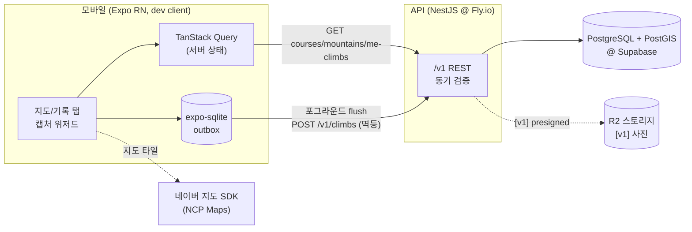

# 등산 앱 (가칭) — 기획/아키텍처 문서

> **등반한 코스가 지도에 색칠된다. 지도가 곧 나의 등산 이력이다.**
>
> GPS 완등 인증 → 코스가 난이도 색상으로 색칠되는 "나만의 정복 지도". React Native(Expo) + NestJS + PostGIS 풀스택 프로젝트. 이 문서 세트는 코드 작성 전 설계 산출물로, 3라운드 팀 리뷰(기술 검증 → 역할별 적대적 리뷰 → 교차 피드백 토론)를 거친 결정들의 기록이다.

## 읽는 순서

| # | 문서 | 내용 | 정본(SSOT) 역할 |
|---|---|---|---|
| 1 | [01-product-spec](./01-product-spec.md) | 문제·경쟁 분석·**v0/v1/v2 컷 표**·화면 인벤토리·성공 지표·로드맵 | 버전 마킹 기준 |
| 2 | [02-backend-spec](./02-backend-spec.md) | ERD·제약/인덱스·**v0 API 표면 전체**·응답 스키마 | 저장·전송 형태 |
| 3 | [03-verification](./03-verification.md) | 인증 판정·관대 정책·위협모델 | **서버 상태 시맨틱** |
| 4 | [04-client-architecture](./04-client-architecture.md) | 3층 데이터 레이어·outbox·상태머신 2개·매핑 표·렌더 파이프라인 | **클라 상태 + 서버→클라 매핑** |
| 5 | [05-design](./05-design.md) | 색·선 스타일 매트릭스·인증 성공 시퀀스·카피 표·야외 요구사항 | **시각·카피** (04 상태 1:1 커버) |
| 6 | [06-data-pipeline](./06-data-pipeline.md) | 시딩 3단계·산림청 SHP ETL·라이선스 체크리스트 | 데이터 |
| 7 | [07-security-privacy](./07-security-privacy.md) | 위치정보법·EXIF·스토어 심사 체크리스트 | 컴플라이언스 |
| — | [adr/](./adr) | [ADR-001 지도 SDK](./adr/ADR-001-map-sdk.md) · [ADR-002 지오 스택](./adr/ADR-002-geo-stack.md) · [ADR-003 호스팅](./adr/ADR-003-hosting.md) | 기술 선택 근거 |

상태 모델은 **03(서버) → 04(클라 매핑) → 05(시각)** 단방향 참조로만 정의된다 — 같은 라이프사이클을 두 문서에서 재정의하지 않는다.

## 시스템 구성도



핵심 흐름: 정상에서 **오프라인이어도** 위저드가 로컬 판정 → outbox 저장 → 낙관적 색칠. 온라인 복귀(늦어도 다음 앱 오픈) 시 flush → 서버 동기 검증(관대 정책) → 색칠 확정.

## 모노레포 예정 구조

```
hiking-app/
├── docs/              # 이 문서 세트 (현재 유일한 산출물)
├── apps/
│   ├── mobile/        # Expo (v0 착수 시)
│   └── api/           # NestJS
├── packages/shared/   # zod 스키마·DTO·난이도 enum
├── tools/etl/         # [v1] 산림청 SHP → PostGIS
└── docker-compose.yml # postgis 로컬 개발
```

pnpm workspaces. (모노레포 채택은 트레이드오프가 없는 결정이라 별도 ADR 없음 — 포트폴리오 저장소 1개에 앱+API+문서.)

## 테스트 / CI 요약

- **GPS 판정 로직 = 최우선 단위 테스트 대상** (순수 도메인 로직). 경계값 표:

| 케이스 | 기대 |
|---|---|
| 반경 내 (149m / 150m) | verified, flags [] |
| 반경 밖 (151m) | verified + `distance` flag (관대 정책) |
| **geometry(degree) 단위 버그** — geography 캐스팅 제거 시 | 테스트가 **실패해야 함** (151m 케이스가 통과해버리면 단위 버그) |
| captured_at 미래/역전 | 4xx |
| 같은 날 같은 코스 2회 verified | duplicate_day rejected + existingClimbId |
| client_ref 재제출 | 200 replayed, 동일 결과 |
| >200km/h 이동 (captured_at 기준) | verified + `speed` flag |
- 통합: **Testcontainers(postgis 이미지)** 로 판정 쿼리·partial unique 검증.
- 클라: outbox 상태 전이·flush in-flight 락 단위 테스트(sqlite in-memory).
- CI: GitHub Actions (lint+test) / 모바일 빌드: EAS Build.

## 비용·빌드 현실 (v0 착수 전 인지)

- **Expo Go 불가** — 네이버맵 네이티브 모듈 때문에 dev client(EAS 빌드) 필수. EAS 무료 티어 **월 30회** — 소진 대비 로컬 `expo prebuild` 빌드 병행.
- iOS 실기기: **Apple Developer $99/년** 선결제.
- NCP: 결제수단 등록 필수, 대표계정만 무료 쿼터 ([ADR-001](./adr/ADR-001-map-sdk.md)).
- 호스팅 v0 목표 $0~5/월 ([ADR-003](./adr/ADR-003-hosting.md)) — Supabase 무료 티어 7일 pause는 시연 전 웜업으로 관리.

## 다음 단계 (v0 착수 체크리스트)

1. NCP 가입 + Maps(신규 상품) 키 발급 → 2. 모노레포 스캐폴드 + docker-compose(postgis) → 3. Expo dev client 첫 빌드(네이버맵 렌더 확인 — **1일차 최대 블로커, 1주 버퍼**) → 4. 3~5산 수동 시딩 → 5. v0 데모 루프: 가입 → 산 보기 → 인증 → 색칠 → 기록 조회.
